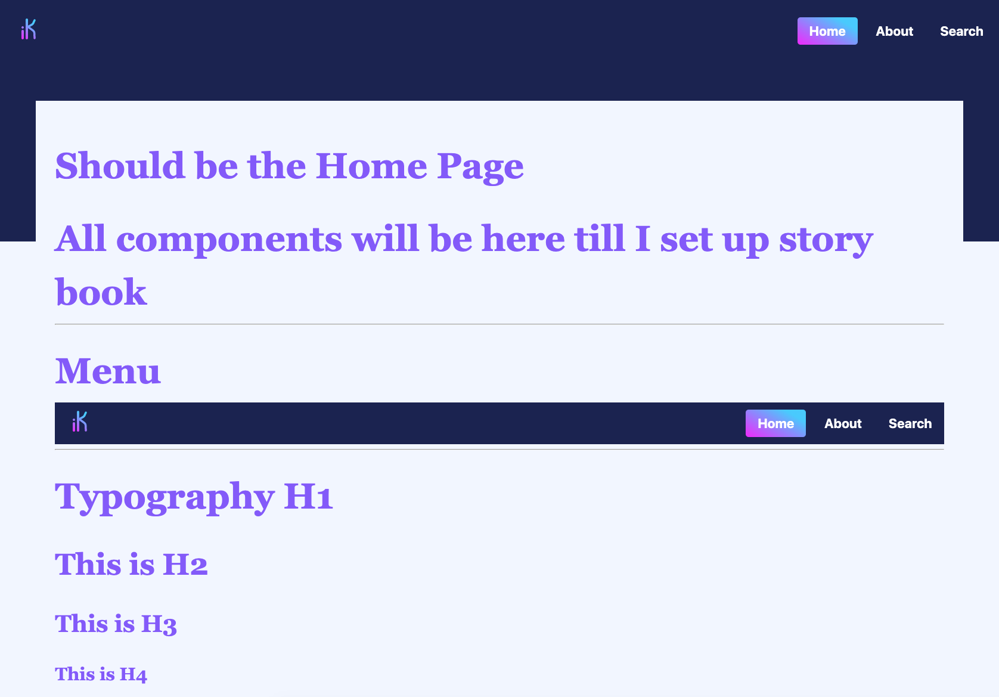

# More than a repository of tools for Innovation... Trying to create a community perhaps!

Starting to put together the different components that we will need to get this up and running! 

Check the [LIVE DEMO](https://ikit.netlify.app/) 

## Dev Notes:

I still have plenty of things todo and will try to build them on the next couple of days

- [ ] Story Book implementation
- [ ] React Helmet
- [ ] SEO component
- [ ] Link the form
- [x] Build framework template page
- [ ] Search page
- [ ] About page
- [ ] Search implementation
- [ ] Share components
- [ ] Implement different layouts 
- [ ] Footer
- [x] CMS integration (strapi) 

